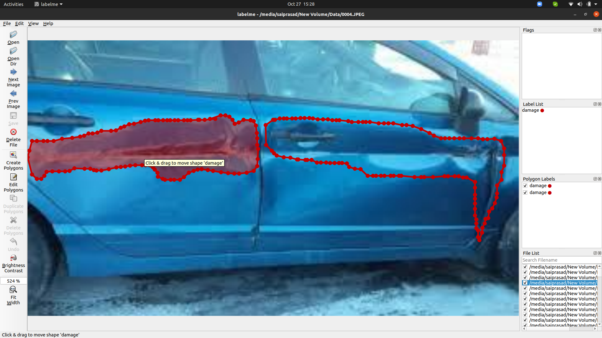
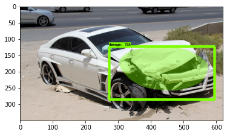

# Vechicle Damage Detection

This project identifies the damage in cars and masks the area of damage, this project can be used in various use cases for example vechicle damage assessment.

# Features!

  - Object Detection
  - semantic segmentation

# Installing Requirements

``` pip install -r requirements.txt ```

# Training a Semantic Segmentation Model

 - After the collection of dataset we need to annotate it using any of the annotation tool.
 - In this project [labelme](https://github.com/wkentaro/labelme) is used to annotate
 - 
 - After annotation in order to create tf record there is a file in research folder in named  [createtfrecords.py](models/research/create_tf_records.py), In this file , in function main we need to pass four arguments they are train image path and the anootations of these images which willbe in json format, the next argument is the label map path this file is path for the labels or classes of the annotated images.
 - now its is time for running the [train.py](models/research/train.py) file with some argents
 - ```python train.py --logtostderr --train_dir=customtraining/ --pipeline_config_path=customtraining/mask_rcnn_inception_v2_coco.config```
 - In the above line there are 2 arguments one is the training folder where all the checkpoints are to be saved and the other file is the config file the all the settings are saved.
 - After training we need to create a inference graph in order to create a forzengraph and to test it.
 - ```python export_inference_graph.py --input_type image_tensor --pipeline_config_path customtraining/mask_rcnn_inception_v2_coco.config --trained_checkpoint_prefix customtraining/model.ckpt-3609 --output_directory inference_graph ```

 - After creating the inference graph run the object_detection_tutorial.ipynb which will predict on test images, i.e the output will be segmented images or masked images.
 - 
